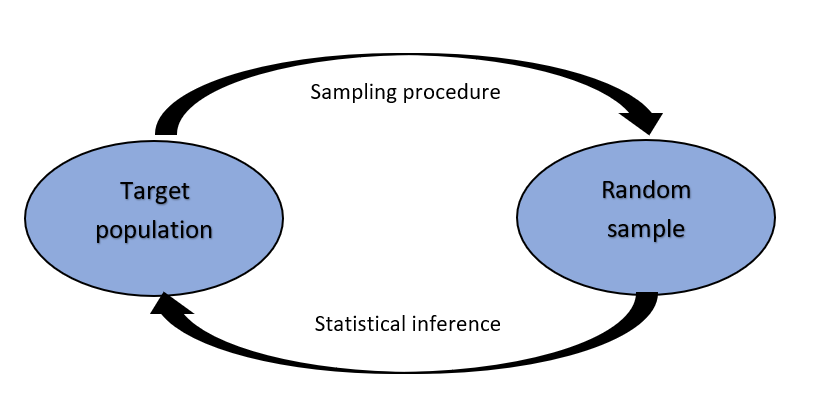
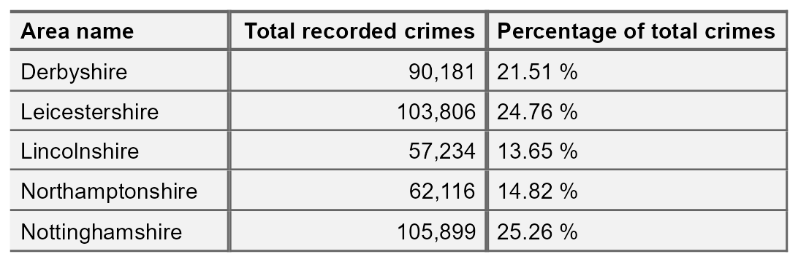
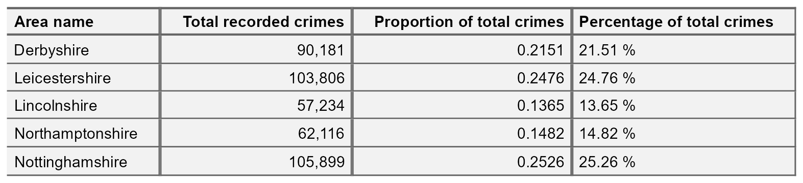
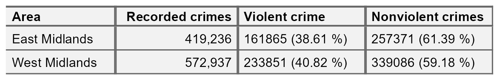
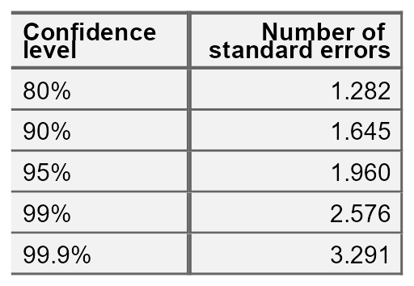

\newpage

# Chapter 1: Introduction to Statistical thinking

## 1.1 What is statistical thinking?
Statistics is the science of data. This includes the collection and storage of data, the visualisation and analysis of samples of data, and the interpretation and communication of results. The overall aim of statistics is to make inferences about a target population of interest based on a random sample.  

People tend to assume that statistics involves complex analysis methods but often, the simplest approaches can be the most effective. In this course, we will not focus on analysis methods. Instead, we will be focusing on **thinking statistically**. 

In general, statistical thinking involves describing data and complex systems in relatively simple terms whilst acknowledging uncertainty that exists. The process of statistical thinking involves critically appraising available data, identifying patterns using visualisations and summaries, and communicating results in a clear, concise manner. Statistical thinking could be thought of as data-driven critical thinking.

## 1.2 Why statistical thinking?
Statistical thinking is a necessary skill, not just in work but in personal lives too. We are constantly bombarded by data via the news and social media. Often the claims made here are exaggerated or skewed to fit a certain narrative. Thinking statistically allows us to sift through all these conflicting claims and make our own minds up based on evidence. 

## 1.3 Course content
In this course, we will not be introducing any complex analysis methods. Instead, we will be focusing on statistical thinking. This involves thinking critically about data, identifying patterns, and describing the data in relatively simple terms. 

Topics that will be covered in this course include:

* The importance of a clear, well-defined research question and how to formulate this
* Common biases and how to recognise them
* Data visualisation as a tool to explore data, investigate trends, and convey important messages
* Summarising data and quantifying differences or trends

\newpage

# Chapter 2: Research questions and biases

## 2.1 Defining research questions
Arguably, the most important step in carrying out statistics is to specify a clear, answerable research question. Often, research questions are not formally documented but they are key to ensuring we are using appropriate data and methods to provide the most suitable advice.

A research question must be fully specified before any data are collected or any analysis plans have been decided. Although there are infinite research questions that statistics can be used to address, all must contain certain elements. These are a target population and an outcome of interest. If an analysis requires a comparison between groups, these must also be clearly specified in the research question. One way to ensure that a research question has been correctly specified is to use the PICO approach:

**P** opulation

**I** ntervention (optional)

**C** ontrol (optional)

**O** utcome

\vspace{0.75cm}

**Population**

First, we must clearly specify a target population of interest. The population described must be as specifically as possible and contain all important characteristics that define the population. This is particularly important in situations where the definition of a characteristic may change or be unclear. 

For example, the Offender Management Statistics categorise age into three groups: juveniles, young adults, and adults. Rather than defining a population simply as male young adults, we would give the full definition: male offenders who were aged between 18 and 20 at the time of sentencing.

\vspace{0.75cm}

**Intervention**

Although not necessary for all research questions, if a study involves a comparison between groups, these groups must also be fully defined and included. The intervention in a research question could be some intervention, procedure or treatment applied to the target population. However, in some cases this grouping definition is not an intervention at all, it could be an exposure of some kind or a characteristic that differs between the groups we are observing and comparing. 

\vspace{0.75cm}

**Comparison**

If an ‘intervention’ group is specified in the research question, the comparison or control group must also be clearly defined. As with intervention, this could involve some intervention or treatment received by the group or it could be a characteristic that differs between groups.

*Note* comparison and outcome groups are optional. Research questions can be fully determined by the population and outcome if no comparisons are required.

\vspace{0.75cm}

**Outcome**

The outcome of interest defined in the research question must be measurable, specific, and relevant to the question we are aiming to answer. It is particularly important to correctly specify the type of variable used for the outcome as this determines the most appropriate visualisations, summaries and analyses. 

## 2.2 Types of variables
Variables, such as those defined in the outcome of our research question, can be classified as either numeric or categorical. 

**Numeric variables** are measured on a number scale. If the outcome can only take whole numbers, this is referred to as a **discrete** numeric variable. Alternatively, if the outcome can take any value on a numeric scale, including with decimal places, this is known as a **continuous** numeric variable. 

**Categorical variables** are classified based on the number of groups or categories they consist of. Categorical variables that only have two categories (e.g. yes/no, positive/negative) are known as **binary** variables. Categorical variables with more than two categories are classified as either **ordinal** where categories have an order (e.g. low/medium/high, never/sometimes/often/always) or **nominal** where there are no ordering to categories (e.g. marital status, ethnicity). 

## 2.3 Examples of research questions
We wish to carry out a study to explore whether a plant-based diet reduces cholesterol levels in obese individuals. Before we look at any data or consider the type of analysis to use, we must convert this into an answerable research question. 
\newpage

Using the PICO method can help determine the important information needed:

- The target population of interest here is obese adults. However, these terms must be as specific as possible and fully defined. Therefore, the **P** in PICO becomes people aged 18 or over with a BMI over 30.

- The **I**ntervention is a plant-based diet. 

- The **C**omparison group will be any diet that is not plant-based, or the target population’s usual diet.

- The **O**utcome of interest is the change in cholesterol from the beginning of the study until some end point. This is a *continuous* numeric variable that is measurable (if the necessary tests are available) and comparable between the groups.

## 2.4 Biases
Whether the data we use to answer our research question is collected by ourselves or taken from a published source, it is important to consider potential biases, or errors, that may be present. Unfortunately most data collection methods are inherently flawed, this makes it especially important to be transparent about the limitations of the data and analysis we provide. 

There are many different types of bias that can arise at different stages of an analysis. Here, I will introduce some of the most common types with examples. 

\vspace{0.75cm}

**Selection bias**

Selection bias occurs when some data are more likely to be included in a sample than others. One of the key requirements of statistical analysis is that a sample must be random and representative of the target population in our research question. If this is not the case, we may not be able to make inferences about the target population and will not be able to answer the research question. 

\newpage

For example, we are interested in whether one hour of yoga per day improves depressive symptoms in adults living in the UK with anxiety and depression. We ask GPs around the UK to suggest patients from their surgery that are currently being treated for anxiety and depression to take part in the study. If the doctors deliberately selected the patients they thought would benefit most from the yoga classes, i.e. those with the highest baseline depressive symptoms, this sample would not be random and the results would be impacted by selection bias.

\vspace{0.75cm}

**Recall bias**

Recall bias occurs when participants are asked to recall past events or experiences as part of a study. These recalls will differ in accuracy and completeness between participants, potentially introducing bias into the variables. 

For example, in a study investigating the impact of ultra processed food on the rates of heart disease, participants were asked to recall how many ultra processed foods they had consumed in the past week. Most participants are likely to forget some of the food they had eaten over a week, and the accuracy of this recall is likely to differ between participants. An improvement to this would be to ask participants to keep a food diary and record their intake at the time.

\vspace{0.75cm}

**Confirmation bias**

Confirmation bias is the tendency to analyse or interpret data in a way that supports preconceived ideas. Unfortunately, confirmation bias is inherent to human nature and can be difficult to spot. It is also one of the reasons that statistical thinking, rather than simply trusting our gut instinct, is so important. The best way to counteract confirmation bias is to acknowledge any pre-conceived ideas or expectations of results before looking at data and being aware of these throughout the process.

## 2.5 Missing data
Another potential source of bias comes from the existence of missing data. Missing data are observations that were intended to be collected but were not. Examples of missing data include:

- Probation practitioners were asked to record details into an administrative system for the purpose of analysis. Practitioners in a certain area were very busy due to a large caseload and did not collect all of the information as it was not relevant to their work. This means that the data added onto the system is incomplete.
- A questionnaire is sent out to households in a local authority, asked for information about household income and employment history. Some households consider these questions too personal and did not fill in the information.
- A clinical trial involves taking blood samples from participants to analyse. Some samples are dropped on the way to the lab and their results are unusable. The analysis dataset contains blank spaces where these results would be.

Where missing data exist, it is important to consider the potential reasons for this and whether these reasons could introduce bias into the sample. For example, if the reason for data being missing is related to the missing values themselves, the observed dataset is no longer random or representative. This is a requirement of making inferences about the target population. There could also be systematic differences between the observed data and the hypothetical missing values. Therefore, analysing incomplete data as if it were complete could lead to invalid conclusions.

Unfortunately, the true reason for missing data and the impact of this on the results will not be known as the data do not exist. When dealing with missing data, our main aim is to identify the most likely reasons and be transparent about the implication of this on our analysis. Failure to recognise and deal with missing data can produce invalid, often misleading results. At a very minimum, we must be transparent about the number and type of missing data within our sample. This should be done before analysis methods are considered as sometimes they may require alternative approaches to overcome the bias introduced by missingness.

\newpage

# Chapter 3: Data visualisation
Data visualisation is a powerful tool with multiple important uses. First, visualisations allow us to explore the data, identify potential outliers and errors, or check that the variables behave in the way we would expect them to if they have been recorded correctly. Visualisations can also be used as an analysis tool, allowing us to identify trends in the data or differences between groups. Finally, visualisations can help to convey messages to an audience in a clear, concise way that is often more powerful than presenting them using numbers or text. In some cases, data visualisations can show results so clearly that further analysis is arguably unnecessary. 

A gruesome example of this was found after the arrest of Harold Shipman, one of Britain’s most prolific serial killers. Harold Shipman was convicted of murdering hundreds of his mostly elderly patients with an overdose of opiates, often administered in their homes. After his conviction, investigators questioned whether he could have been caught earlier. The visualisation below shows the time at which patients died who were registered at other local GP surgeries against the time of death for those who saw Harold Shipman. The difference is so stark that it can be argued that no formal statistical analysis would be required to confirm this.

<!-- --> 

\newpage

Often, trends and differences in data will not be so obvious, but it is important to understand which data visualisations can be useful in different settings. This section will introduce some of the most common data visualisations, provide examples of these using real data, and highlight important characteristics of each visualisations, as well as potential flaws to be aware of.

## 3.1 Choosing the most appropriate visualisation
The most appropriate choice of visualisation will depend on the type of variable(s) we wish to display, the number of variables and the message we are trying to disseminate. Common plots used to display combinations of different types of data are given in following table: 

## 3.2 Visualising a single, numeric variable
**Histograms** are a common data visualisation method for a single numeric variable. Histograms consist of bars that show the number of observations in a sample that lie within a numeric range: the higher the bar, the more common those values are. They are used to check the distribution (or shape) of variables, and are useful to identify outliers and potential errors in the data. The distribution we are most often checking for is the **normal distribution**, also known as a bell-shaped curve, which occurs naturally in many variables and is a common assumption for many statistical methods. 

\newpage

A normal distribution is characterised by a single peak in the centre of the histogram, also known as the average or mean. The histogram will then have two symmetric tails that show more ‘extreme’ values become less common as they are further from the average:

<!-- --> 

\newpage

The histogram below shows the settlement funding assessment (SFA) for each local authority in England in 2015 given in millions of pounds:

<!-- --> 

The first thing we can see from this histogram is that it is clearly not a normal distribution. The peak of the sample distribution is close to 0, and there is a very long upper tail which is not symmetrical to a lower tail. Another important thing to note is the presence of outliers. Most local authorities had an SFA of approximately £300 million or less. There are two observations that have values much larger than this which must be investigated. 

The highest value on the histogram represents the Greater London Authority with an SFA of £1,163 million, the second is from Birmingham with an SFA of £612 million. Observations should only be removed from a sample if they should not be included in an analysis. The Greater London Authority is a collection of smaller local authorities that are already in the dataset. This value must be removed before any further analysis is carried out to avoid duplicating observations. However, the Birmingham observation represents a single local authority that has a large value because it covers a large population. The Birmingham observation should not be removed from the analysis as it is not an error, but we should make a note that there is an outlier in the SFA variable as this could influence certain results if further statistical analysis is carried out on this data. 

\newpage

The updated histogram, without the Greater London Authority duplicate, is given below. Notice that the x axis limits have changed:

<!-- --> 

\newpage

When the objective of a histogram is to check the distribution of a numerical variable, a density curve can be added to the histogram which aims to smooth the bars into a continuous curve. These curves are usually easier to compare to a distribution of interest:

<!-- --> 

The density line is far from symmetric, indicating a **skewed distribution**. A skewed (non-normal) continuous variable is not a sign of an error. In this example, a highly skewed variable is to be expected. The majority of local authorities in England consist of small populations with a minority representing large cities (for example, the Birmingham local authority identified above) with much higher spending. 

As with all data visualisations, it is important to ensure that a histogram is showing the data in the clearest way. Histograms’ appearances are heavily influenced by the width of the bars (sometimes referred to as 'bins') shown on the plot. The number of bars on a histogram must be large enough to detect important trends and peaks in the data, but not so large that the shape becomes overwhelming and difficult to interpret.

\newpage

Figures 3.3 - 3.5 have 30 bars (the default set by some statistical software packages). When we reduce the number of bars to 15, the curve becomes smoother but the dip in distribution at around £50 million is no longer visible:

<!-- --> 

\newpage

If the number of bars is increased to 100, we can see there are many small peaks in the data that we were not able to see with wider bars, however the overall distribution of the data becomes more difficult to interpret:

<!-- --> 

When creating histograms, it is important to try different numbers of bars to ensure that important trends are not missed. When interpreting histograms, we must keep in mind that a very small number of bars may be hiding something.

\newpage

## 3.3 Visualisations to compare numeric variables between groups
Although histograms are useful to visualise the distribution of a numeric variable across a whole sample, we often want to compare a variable between groups. The choice of visualisation will depend on which aspect of the numeric variable we are interested in comparing, for example the entire distribution or some kind of summary of the groups. In this section, we will compare the settlement funding assessment (SFA) of local authorities in England in 2015 from the previous section between regions, using visualisations that show an increasing amount of information.

### 3.3.1 Bar chart of averages
The simplest, least informative comparison of SFA between regions would be to show the average of each group. This can be done using a **bar chart** which will consist of a bar per region. The length of each bar will represent the average SFA for the region it represents. The most common choice of average for charts of this sort is the mean. We shall discuss in later sections why this may not be the most appropriate choice.

<!-- --> 

This bar chart shows that local authorities in London had the highest SFA on average, while the East Midlands and South East had the lowest. The chart is clear and easily interpretable but is missing a considerable amount of information. In particular, the chart does not give any information about the spread of values in each group. Although the group averages look different, there is likely overlap in values in each of the groups. 

### 3.3.2 Box plot
A common visualisation to compare average values across groups, whilst also showing measure of spread, is a **boxplot**. Boxplots contain a measure of the centre of each group, given by the median, surrounded by a box with limits defined by the interquartile range (IQR). The IQR is the difference between the 75th percentile (the value below which 75% of the sample lies) and the 25th percentile (the value below which 25% of the sample lies), giving the range of the middle 50% of the sample. The box has whiskers attached that give the range excluding outlier, and outliers are highlighted as points on the plot. The definition of outlier differs across software, however a common definition used for the boxplot below is any observation that lies further than 1.5 times the IQR from the box. 

<!-- --> 

This boxplot shows far more information than the bar chart of averages. We can clearly see the outlier which was identified earlier as Birmingham. We can also see that, although London has the highest average SFA, there is quite a large overlap of values with other regions. The East Midlands, East England, and South East regions had a large number of outliers and a very small IQR which should be investigated further. 

The dataset shows that the many outliers are not errors, these regions consist mostly of very small local authorities with very low spending and few towns and cities that have substantially higher spending. Therefore, any larger areas in these regions will appear as outliers compared to the very small local authorities. 

### 3.3.3 Violin plot
We gain more information from the box plot compared to the bar chart but we are still losing a lot of information by only showing summary measures. We can see the range of the middle 50% but we are not able to see how those values are distributed. **Violin plots** show the density of groups, similar to the density curve added to the histogram previously but rotated 90 degrees. Violin plots show the full sample and are particularly useful where a distribution does not have a single peak (which is assumed by box plots).

<!-- --> 

One benefit of this violin plot compared to the boxplot is that we can see the very bottom-heavy distribution of SFA in the East Midlands, East England and South East regions which explains the large number of outliers in the boxplots. However, the violin plot of SFA per region is difficult to interpret with so many regions. 

\newpage

### 3.3.4 Dot plot
As violin plots are produced using density estimates from the data, they are still not giving all information from the sample. They are also not very useful where there are long-tailed distributions, as we can see in the West Midlands region in the previous plot, as they can give the illusion of data existing where it does not (between the outlier and the rest of the group). To overcome these issues, we can show every observation in the sample as points, separated into groups, in a **dot plot**. Dot plots have the same axes layout as the previous plots, with grouping on the x axis and the numeric variable on the y-axis.

<!-- --> 
\newpage

Without checking, this dot plot appears to show every local authority’s SFA grouped by region. However, there are many local authorities that have very similar SFA values that can not be seen as they are currently lying on top of one another. To overcome this, a dot plot can be adapted by spreading the points out along the x-axis, also known as **jittering**:

<!-- --> 

By jittering the points, we can now see the differences in the distribution of points in each region. The outlier of Birmingham is clearly visible, as are the bottom-heavy distributions of some regions. We can clearly see the differences in the number of observations in each region. For example, it is clear that the North East region has less local authorities and less variability compared to other regions. One thing that is not clear from this dot plot that was clear from previous plots, is that the London region had the highest average SFA. 

\newpage

### 3.3.5 Multi-layer plots
Sometimes a single choice of plot will not be enough and multiple visualisations are needed. In this case, we may wish to express the differences in summary statistics between regions, without losing information about the overall distribution and density of the sample. One solution would be to provide a boxplot with points added as an extra layer to the plot:

<!-- --> 

This final plot clearly shows the differences in the average SFA between regions, the outlier in the West Midlands region (Birmingham), and the differences in the shapes of distributions between regions. Although we have added an extra layer to each plot, the message of both is still clear and easily interpretable. Where additional layers hide a message or over complicate a visualisation, one or more complicated layers should be removed.

\newpage

## 3.4 Visualising a single, categorical variable

Visualising categorical variables involves describing their distribution between categories. This can be done using counts or the proportion of observations in each group. 

### 3.4.1 Frequency table
Both counts and proportions/percentages can be displayed using **frequency tables**. For example, the number of recorded crimes in the East Midlands in 2023, categorised by police force:

Frequency tables can provide a lot of information and, where there are not many categories, can be easy to interpret. However, they can quickly become overwhelming when there are many categories displayed, patterns in the data can be harder to spot, and they can look boring.

\newpage

### 3.4.2 Bar chart
The same data can be displayed using a **bar chart**, the categorical equivalent of a histogram, where the length of each bar represents the number of observations in the category:

<!-- --> 

Although this bar chart is also not particularly interesting, our eyes are immediately drawn to the differences between groups. We can immediately see that Lincolnshire and Northamptonshire had fewer recorded crimes than the other police force areas, and that Leicestershire and Nottinghamshire had the highest number of recorded crimes and were at a similar level. 

\newpage

Bar charts can be formatted to draw attention to important results, for example by ordering the bars from largest to smallest frequencies to highlight the differences in groups (note that this is only appropriate where there is no ordering to the groups):

<!-- --> 

\newpage

Colours can also be used to emphasise groups that are of interest to the audience. For example, if this graph was displayed as part of an investigation into crime levels in Derbyshire, we could change the colour of this bar to draw attention to it:

<!-- --> 

\newpage

We can also swap the axes so that the bars run horizontally and the frequencies are shown on the x axis. This can sometimes make the ordering and length of the bars easier to read, or can make the graph more compact where the group labels are long:

<!-- --> 

In general, bar charts have a frequency axis that begin at 0. Howeverm if all values are very high, this can make it difficult to distinguish between groups. The frequency axis can be amended and begin at another number but it is important that this does not distort the message as it can make differences appear larger than they actually are. 

\newpage

For example, using the recorded crime data, we could set the frequency axis to begin at 50,000 as all counts were higher than this:

<!-- --> 

Although the plot shows the same information as the others, the smaller counts appear much smaller than the original plot and the difference between the highest and lowest values is more pronounced. Although this plot is showing the same information, this small change has affected how our brains interpret the results. 

When generating bar charts, changing the axis limits so they do not begin at 0 should only be used when it is necessary to interpret very large numbers and where we are sure it will not manipulate the results. When interpreting bar charts, be sure to check where the axes begin and take this into account.

\newpage

### 3.4.3 Pie chart
An alternative approach to summarising and visualising categorical variables is to use proportions. One benefit of considering proportions as opposed to the counts is that they allow us to take account of the sample size and put the counts into context. Proportions of a single sample can be visualised using a **pie chart**. Each ‘slice’ of the pie represents a category and the size of the slice represents the proportion of the sample that lies within that group. 

For example, taking the recorded crime statistics from 2023, we can show the proportion of the total reported crimes in the East Midlands separated by police force area:

<!-- --> 

\newpage

Figure 3.19 shows the same data as the bar charts shown earlier. However, it is harder to compare the groups as the proportions are quite similar. One possible solution to this issue is to add labels with the values onto each slice:

<!-- --> 

Pie charts are generally discouraged because they are more difficult to interpret than bar charts or frequency tables. Although they are easier to interpret when differences in proportions are larger than the example showed here, they do lose more information than their alternatives.

\newpage

## 3.5 Visualisations to compare categorical variables between groups

Bar charts introduced in the previous section can be extended to include a further grouping variable and used to compare the distribution of observations between categories across groups. **Stacked bar charts** are used to compare the proportion of observations in different categories across groups, whereas **side-by-side bar charts** compare counts. 

### 3.5.1 Stacked bar chart

A stacked bar chart is useful where the total number in each group is important, as well as the distribution of these groups between categories. As with a standard bar chart, the total number of observations in each group determines the length of the bar. These bars consist of multiple smaller bars that represent the number of observations in each category. 

For example, using the data from the previous section, we can compare the overall number of recorded crimes, as well as the different types of crimes, between police forces in the East Midlands:

<!-- --> 

This bar chart clearly shows that Nottinghamshire and Leicestershire had the highest recorded crimes, and Lincolnshire and Northamptonshire had the lowest, which we had already seen previously. In addition to the findings from the previous bar charts, we can now see that the largest proportion of crimes across all police forces were violent crimes and theft. The distribution across types of crimes seems similar between police forces. If the distribution between the types of crimes is more important than comparing the total number per police force, we may also consider a **proportion stacked bar chart**. 

### 3.5.1 Proportion stacked bar chart

Proportion stacked bar charts are an alternative to the stacked bar chart which compares the proportion of each group that lie in different categories. The length of each bar is equal to 1 (representing the whole group size), and consists of smaller bars representing the proportion of the group in a category. These are particularly useful when differences in group sizes are not important, but the relative distributions between groups are.

<!-- --> 

The proportion bar chart confirms that the distribution of different crime types is similar across police forces, regardless of the total number of crimes. 

### 3.5.3 Side-by-side bar chart

Side-by-side bar charts allow us to compare the number of observations in each category between groups. The smaller bars that make up a stacked bar chart are placed next to one another, meaning the length of bars now represents the total observations per category per group. They are useful when comparison of the overall total of groups is not important, and where there is a small number of groups and/or categories to compare between.

The previous example would require 45 bars in total (9 bars for each of the 5 police forces). This would be almost impossible to show clearly on one axis, so for this example, we will compare the three most common types of crime between forces: violent, theft, and public order.

<!-- --> 

All three bar charts show the same information in different formats. The most appropriate choice of these would depend on the motivation behind the plot. For example, are we interested in comparing the overall total crimes between regions? In which case, a stacked bar chart would be most useful. Would we prefer to compare the distribution of the different types of crimes between regions? Then a proportional stacked bar chart might be helpful. Or is the intention of the plot to compare the total of a certain type of crimes between regions, rather than the overall total? Then a side-by-side bar chart would be most appropriate.

## 3.6 Visualisations for two or more numeric variables
Visualising single variables is important when checking the data for errors and distributions. However, we often want to investigate relationships between multiple variables in a dataset. When exploring the relationship between two numeric variables, we should consider a **scatterplot**. One of the numeric variables is displayed on the vertical, or y-axis (often the outcome of interest or dependent variable), and the other is displayed on the horizontal, or x-axis (usually the explanatory variable). Each observation is represented with a point on the graph area. 

Scatterplots are useful to explore the data and identify outliers/errors which may not be as clearly visible in univariate plots. Scatterplots are also useful to generate hypotheses about the relationship between variables. For example, whether they are positive or negative.They can also explore the nature of relationships in terms of whether they are linear or not, which is a requirement of some statistical methods.

The scatterplot below shows the relationship between cancer mortality in US counties in 2015 and the level of poverty in these counties. Cancer mortality rate has been given on the y-axis as this is the outcome of interest which we think may be dependent on poverty (the explanatory variable):

<!-- --> 

\newpage

The scatterplot shows there are no unexpected outliers, and there appears to be a positive linear relationship between these variables. That is, as the percentage of the population living in poverty increases, the cancer mortality appears to increase on average. Note that we are not making inferences about the total population, nor are inferring causation from this graph.

This potential relationship can be made clearer by adding a line of best fit to the scatterplot. There are different methods of estimating a line of best fit, the most common being a linear model. Linear models produce a line that minimises the difference between each point and the line drawn. Alternative methods are available where a linear relationship is not appropriate.

<!-- --> 

Adding a line of best fit to the scatterplot shown earlier highlights the positive association between poverty rate and cancer mortality. Although the line does not fit the data perfectly, it gives an estimation of the direction and magnitude of this relationship which can be investigated formally using statistical analysis. 

\newpage

Scatterplots can be extended to show additional variables by changing the appearance of points. Categorical variables can be added using a difference colour or symbol for each group:

<!-- --> 

In this example, unemployment level has been added to the plot using different colours, with the key given in the legend. On average, areas with high unemployment appeared to have higher levels of poverty and cancer mortality. We would expect unemployment and poverty level to be highly related and, given that higher levels of poverty appeared to be associated with higher mortality, also related to higher cancer mortality rates.

\newpage

If we believed that the relationship between the variables given on the x- and y-axes differed between groups, we could also provide a line of best fit per group rather than for the sample as a whole:

<!-- --> 

The lines of best fit have approximately the same gradient, indicating that the relationship between poverty and cancer mortality is approximately equal. However, the line for high unemployment is consistently higher than the other group which shows this group had a higher mortality rate on average at different poverty levels.

\newpage

Numeric variables can also be added to scatterplots by adjusting the colour or size of the points based on each observations’ value. For example, the average age of each county could be added:

<!-- --> 

The relationship between age, poverty and cancer mortality is hard to decipher as most counties have similar average ages which is not obvious with a continuous colour palette. 

Additional variables should only be included in data visualisations where they are needed and where they do not confuse the original message. Overloading a visualisation can make it hard to interpret and lose information. In some cases, it is better to have multiple, simple (but clear) plots rather than a single, complex plot. 

\newpage

## 3.7 Visualising temporal data
Where a variable has been measured repeatedly over time, we want to ensure that any visualisation makes it clear that these observations are related. The most common visualisation used for temporal data is a line graph. Line graphs have the measure of time along the x-axis and the variable measured over time on the y-axis. Each observation’s values are connected over time using a line. Line graphs are useful to explore trends over time, for example whether values have been increasing or decreasing. 

<!-- --> 

This line graph shows the number of violent crimes recorded in England between 2010 and 2020. From this simple graph, we can clearly see that there is a strong, downward trend. That is, the number of violent crimes recorded has decreased over the 10-year period. 

Line graphs are not only useful at determining overall trends but also checking the data for inconsistencies. For example, all years experienced a decrease in recorded crimes apart from 2014 - 2015 where there was an increase. We could go back and check the source of the data, make a note of potential reasons for this difference, and be sure to communicate this as part of our interpretation.

\newpage

Line graphs can be used to compare trends between different groups by adding multiple lines to the same graph. For example, the following graph shows the number of magistrate court cases, by type, between 2012 and 2023. Each case type has a different coloured line, and the interactions between lines are clear:

<!-- --> 

This line graph is the perfect example of where a visualisation is more powerful than simply writing results in a table of texts. The drastic drop of disposals due to closure of magistrates courts during the COVID-19 pandemic is stark. This is coupled with the vast increase of outstanding cases which we can see has not returned to pre-COVID levels. This can be explained by the other lines on the graph as we can see that the number of receipts are almost back to previous levels, whereas the number of disposals has still not quite recovered.  

\newpage
 
# Chapter 4: Summarising data

Summary statistics allow us to quantify and explore different parts of a sample of data. They can be provided alongside data visualisations introduced earlier in the course to support results and interpretations. 

**Note** that the summary statistics introduced in this section describe only the sample data so cannot be used to answer research questions fully unless all data on the target population has been collected. 

The choice of summary statistics will depend on the type of variable(s) we wish to explore, the distribution of these variable(s) and the aspect of the data we would like to quantify. When interpreting summaries provided from analysis that has already been completed, it is important to check that the most appropriate summaries have been used and that interpretations of them will be valid.

## 4.1 Summarising categorical variables

To summarise a single categorical variable, we simply need to quantify the distribution of observations lying in each group. The simplest way to do this is to count the number of observations that lie in each group, as we have seen previously displayed in frequency tables. However, a simple count can be difficult to interpret without proper context. Often, we wish to present these counts relative to the total sample that they are taken from.

The proportion of observations in a given group is estimated as the number in the group divided by the total sample size. This gives a value between 0 and 1. Multiplying the proportion by 100 will give the percentage in each group, taking the value between 0 and 100%. 

For example, the number of recorded crimes in the East Midlands in 2023, shown in the previous section in a bar chart and pie chart, can be presented as percentages and proportions:

\newpage

Both the proportions and percentages give the same information (percentage is simply proportion multiplied by 100) but percentages are generally easier to interpret. In this example, Nottinghamshire had the highest proportion of crimes with just over a quarter (25.26%) of the total. This was closely followed by Leicestershire.

In cases where the proportion and percentage in a given group is very small, we may wish to multiply the proportions by a larger number to make values easier to interpret. These values are known as rates and are interpreted as the value per the number multiplied by. For example, if the proportion in a group was 0.0005, this could be multiplied by 10,000 to give a rate of 5 per 10,000. 

## 4.2 Summarising numeric variables

Numeric variables are typically summarised using the **centre** of the variable, also known as the average, and a measure of the **spread** of the variable. The most appropriate choice of summary statistics will depend on the distribution of the variable. More specifically, whether the numeric variable is normally distributed or not. The shape/distribution of a variable is typically investigated by plotting data in a histogram.

### 4.2.1 Measures of centre

The average of a numeric variable is another way of saying the centre of its distribution. Often, people will think of the **mean** when trying to calculate an average, however this may not always be the case. 

<!-- --> 

When data are normally distributed, the mean is the central peak of the distribution. This is calculated by adding together all numbers in the sample and dividing it by the sample size. However, when the sample is not normally distributed and the peak does not lie in the middle, extreme values or a longer tail will pull the mean towards it. This means that where data are not normally distributed, the mean will not be the centre and the value will be invalid. Where this is the case, the **median** should be used instead. The median is calculated by ordering the numeric values from smallest to largest and selecting the middle value.

Let’s consider the sample below of 10 students’ heights in centimeters from a high school class:

**142.23, 149.58, 146.06, 160.42, 174.64, 172.54, 148.67, 143.00, 173.11, 168.72**

To calculate the mean height from this sample, we add these values together, giving 1578.97cm, and divide the total by 10. Therefore, the mean height of these 10 students is 157.897cm.

The median height is calculated by ordering the heights from smallest to largest:

**142.23, 143.00, 146.06, 148.67, 149.58, 160.42, 168.72, 172.54, 173.11, 174.64**

We then take the middle value. As the sample size is even, the median will lie between two values - the 5th (149.58cm) and the 6th (160.42cm). To calculate the median, we add these values together and divide this by 2. The median of this sample is therefore 155cm.

When data are normally distributed, the mean and median will give the same, or very similar, values. This is because both are measuring the centre. However, when the data are skewed, the mean and median will differ. We prefer to use the mean where possible as it is the more powerful measure. This means that it uses more of the data than the median and is therefore more sensitive to changes in the sample. 

### 4.2.2 Measures of spread

Generally the measure of the centre of a numeric variable is presented with a measure of spread, or how wide/narrow the distribution is. As with the centre, the most appropriate values will depend on whether the sample is normally distributed or not. 

The most simple measure of spread is the **range** of a sample. The range is either presented as the smallest and largest values from a sample or the difference between these. From the sample of heights earlier, the range would either be given as [142.23cm, 174.64cm] or the difference between these values, 32.41cm. 

The issue with using the range is that it is entirely defined by the most extreme values in the sample and does not give any information about the rest of it. An alternative to this would be to give the range of the middle 50%, also known as the **interquartile range** (IQR). The IQR is the difference between the 75th percentile, or upper quartile, and the 25th percentile, or lower quartile. As with the median, this is calculated by ordering the sample from smallest to largest. The sample is then cut into 4 and the quartiles are calculated. As with the range, the IQR can be given as the two values or the difference between them. 

The lower quartile of the sample of 10 heights given earlier is the 3rd value in the ordered sample, 146.06cm, and the upper quartile is the 8th value in the ordered sample, 172.54cm. We could either present this as two values, or as the difference between them: 26.48cm. This means that 50% of the sample heights lie between 146.06cm and 172.54cm, or the width of the middle 50% of this sample is 26.48cm. 

Both the range and IQR only use 2 values from the sample. As with the median, these measures discard a lot of information from the summaries. Where the sample is normally distributed, the **standard deviation** (SD) can be used which measures the average distance between each observation and the mean. The larger the SD, the wider and flatter the normal curve will be; the smaller the SD, the narrower and taller the curve will be:

<!-- --> <!-- --> 

The standard deviation is only appropriate where a numeric variable has a normal distribution, otherwise this value is meaningless. If a sample is normally distributed, then the entire sample can be completely described just using the mean and standard deviation, even when the sample values are not given. As the distribution is symmetrical, the mean and standard deviation can be used to estimate ranges of values. For example, it is known that approximately 68% of a sample will lie one standard deviation from the mean, approximately 95% within 2 standard deviations from the mean, and around 99.7% within 3 standard deviations:

<!-- --> 

This knowledge can also be used to check the mean and standard deviation were appropriate summary statistics, even if we have no other information. For example, we saw earlier a sample of settlement funding assessment (SFA) values for local authorities in England in 2015. Using a histogram, it was clear that this sample was not normally distributed. However, let’s assume that we do not have the data to plot a histogram, instead we are just given the mean, £50.85 million, and the standard deviation, £75.06 million. 

If the sample SFA were normally distributed, we would expect approximately 95% of the values to lie within 2 standard deviations of the mean. That would mean 95% of the values lying between -£97.26 million and £198.97 million. The SFA for local authorities cannot be negative, therefore this range would contain a lot of impossible values. This shows that the mean and standard deviation are not appropriate summaries, and the sample is not normally distributed.

\newpage

# Chapter 5: Making comparisons

Often, our research question will involve a comparison between groups, investigating trends over time, or investigating a relationship between two numeric variables. There are multiple approaches we can use to compare groups but the correct choice will depend on the outcome of interest and the type of relationship we are interested in. This section will describe the most common comparative statistics, their interpretations, and the reasons we may choose to use one approach over another.

## 5.1 Comparing a categorical variable between groups

When comparing a categorical variable between groups, we are often comparing the summary measures that were introduced in the previous section: proportions, percentages, and rates. These summaries are either compared using the absolute difference or the relative difference. 

To demonstrate the difference between these comparisons, let’s consider the number of recorded crimes in the East Midlands we saw earlier and compare them to the number recorded in the West Midlands. These crimes are categorised as either violent or non-violent. We wish to compare the distribution of these types of crimes between the regions, i.e. was the proportion of recorded crimes that were violent similar between regions. The table below shows the number and type of crime, along with the percentage of total crimes in each region that were classified as either violent or non-violent:

The absolute difference is calculated by simply subtracting proportions or percentages between groups. In this example, the absolute difference in proportions of total crimes that were violent is (0.408 - 0.386) 0.22, and the absolute difference in percentages is (40.8% - 38.6%) 2.2%. The West Midlands had 2.2% higher percentage points of recorded violent crimes than the East Midlands. If we carried out the sums the other way round, we would get a negative number (-2.2%), indicating a reduction in the percentage points in East Midlands compared to the West. Absolute differences are interpreted relative to a null value of 0, representing no difference. 

Alternatively, the relative difference is found by dividing one value by another. Unlike the absolute difference, this will be the same whether we use the proportion or percentage. The relative difference in the percentage of violent crimes between regions is (40.8% / 38.6%) 1.057. This means that the percentage of crimes recorded as violent was 1.057 times higher in the West Midlands compared to the East Midlands. If we wanted to do this comparison the other way around (comparing the East to West Midlands), we would find a relative difference of (38.6% / 40.8%) 0.946. Therefore, the percentage of recorded crimes in the East Midlands that were violent was 0.946 times the percentage in the West Midlands. When interpreting relative differences, we are comparing the result to a null value of 1, given when both values are equal. As 0.946 is below 1, this represents a reduction. 

## 5.2 Comparing numeric variable between two groups

The most appropriate method to compare a numeric variable between groups will once again depend on the distribution of the variable. A comparison can either be made using the difference in means, where both groups have a normally distributed sample, or difference in medians, where one or both of the samples are skewed. 

Earlier in the course, we saw the settlement funding assessment (SFA) for each local authority in England in 2015. We may want to compare this between two regions, for example between the North West and the Yorkshire and Humber regions. Before choosing the most appropriate comparison, we must check the distribution of SFA in each region using a histogram:

<!-- --> 

As with the full sample, both regions’ values are positively skewed (with a longer upper tail). This means that a comparison of means would be inappropriate and we must use the difference in medians. The median of the North West was £57.15 million, the median in Yorkshire and the Humber was £58.49 million. This makes the median difference £1.34 million (or -£1.34 million depending on which difference we are finding). Therefore, the SFA was £1.34 million higher on average in the Yorkshire and Humber region than in the North West in 2015.

## 5.3 Comparing variables over time

When dealing with temporal data, it is important to quantify differences across time as well as visualising them using a line graph. Comparison across time is typically given as an absolute difference between time points, as a relative difference, or this is commonly converted into a percentage change. 

Recall the line graph given in an earlier section showing the reduction in the number of violent crimes recorded between 2010 and 2020:

<!-- --> 

This difference can be quantified by comparing the number of violent crimes recorded in 2010 and 2020. The absolute difference is found by subtracting the number of violent crimes recorded in 2020, 1,239,000, by the number in 2010, 1,841,000. There were 602,000 less violent crimes reported in 2020 compared to 2010.

The relative difference is found by dividing one count by the other. In this example, the relative difference ($1,841,000 \div 1,239,000$) is 1.486. This means that there were 1.486 times more violent crimes reported in 2020 compared to 2010. The percentage change can be found by comparing the relative difference to the null value of 1 (no relative difference). When comparing  2010 to 2020, the relative difference was 0.486 above 1, giving the proportion increase. This can be multiplied by 100 to give a percentage increase of 48.6%. Therefore, there were 48.6% more violent crimes reported in 2010 compared to 2020.

The relative difference can also be found by comparing 2020 to 2010 if we want to give the relative or percentage decrease in violent crime. The relative difference ($1,239,000 \div 1,841,000$) is 0.673, so there were 0.673 times the number of crimes reported in 2020 than 2010. This result is not intuitive, so converting the difference into a percentage decrease can make the value easier to interpret. As with an increase, we first find the difference between the relative difference and the null (1 - 0.673). This gives a proportion decrease of 0.327 or a percentage decrease of 32.7%. Therefore, there were 32.7% fewer violent crimes reported in 2020 compared to 2010.

## 5.4 Identifying trends between two numeric variables

Correlation coefficients are summary statistics that describe the strength and direction of a relationship between two numeric variables. There are different types of correlation coefficients that exist, the choice of which depends on the nature of the trend it is measuring: is it linear or nonlinear?

The **Pearson’s correlation coefficient** measures the association between numeric variables if we assume it is linear. It essentially measures how close points lie to the line of best fit added to a scatterplot. The alternative to Pearson’s correlation is **Spearman’s correlation coefficient**, this measures the general trend upwards or downwards, whether or not this is linear. As with medians and IQRs, Spearman’s correlation coefficient uses less of the data than Pearson’s so we only use it where necessary.

Correlation coefficients take a value between -1 and 1. A value of 0 represents no association, values of +/- 1 represent perfect association (a straight or curved line depending on the choice of statistic). Generally, a correlation coefficient will lie between 0 and +/- 1 where the further the value gets from 0, the stronger the relationship is.

A correlation coefficient is said to show a **positive association** if the value is above 0. This means as one variable increases, the other also tends to increase:

<!-- --> 

<!-- --> 

A correlation shows **negative association** if the value is below 0. This means as one variable increases, the other tends to decrease:

<!-- --> 

<!-- --> 

A correlation coefficient close to 0 represents little or **no association**. However, it could also be an indication that the relationship is nonlinear and the Pearson coefficient is inappropriate. In this case, the Spearman coefficient may be more appropriate:

<!-- --> 

<!-- --> 

\newpage

# Chapter 6: Inferential statistics

## 6.1 What are inferential statistics?

At the beginning of the course, we saw that one of the main aims of statistics is to make inferences about a target population of interest based on results of analysis applied to a random sample. These inferences require inferential statistics, namely **p-values** and **confidence intervals**. These are estimated by combining results from the random, representative sample taken from the target population, and information about the sample size and precision of the sample estimate.

## 6.2 Measures of precision

Inferential statistics require a measure of how precise a sample estimate is. **Precision** is quantified using the standard error (SE), calculated using the sample size and sample variability. The formula used to calculate a standard error depends on the type of parameter we wish to obtain from the target. For example, the standard error of a single mean ($SE(\bar{x}$)) is found by dividing the sample standard deviation ($SD$) by the square root of the sample size ($n$):

$SE(\bar{x}) = \frac{SD}{\sqrt{n}}$

Regardless of the formula used or the parameter of interest, the larger a sample is, the more precise an estimate will be. Conversely, the more varied a sample is, the less precise an estimate is. A precise estimate is represented by a small standard error value. Standard errors are used to estimate inferential statistics (p-values and confidence intervals) based on the central limit theorem.

## 6.3 Central limit theorem

The central limit theorem states that parameter estimates (e.g. mean, difference between means) from repeated, independent random samples taken from a population will tend towards the normal distribution. This will be the case even where the target population does not follow a normal distribution. The centre/peak of the normal distribution will be the true population parameter, and the spread will be described by the standard error.

For example, if we took many random samples from a target population and found the mean of each sample, these sample means would follow a normal distribution. The mean and middle of the normal distribution would be the target population mean, and the spread would be described by the standard error of the mean.

<!-- --> 

As we know that repeated sample parameters tend to a normal distribution, we can exploit the properties of the normal distribution to understand more about the target population parameter.

## 6.4 Confidence intervals

A confidence interval is a range of values that the true population statistic is compatible with based on the sample estimate, precision, and some pre-defined level of confidence.

The confidence interval is created assuming the central limit theorem. As the hypothetical repeated estimates are assumed to follow a normal distribution, we can use the sample estimate of the parameter and the standard error to obtain ranges within which we would expect a certain percentage of parameter estimates to lie. 

For example, if we were interested in the mean of a population ($\mu$), we could use the sample mean ($\bar{x}$) to estimate the population mean and capture a range in which 95% of the hypothetical repeated sample means would lie. The boundaries of this interval could be calculated using the formula: [$\bar{x} \pm 1.96 \times SE(\bar{x})$].

<!-- --> 

This 95% range is known as the 95% confidence interval. We are 95% confident that the true target population mean lies within this interval. 

The confidence level can be adjusted depending on how confident we wish to be about the true population parameter. Adjusting the confidence level changes the number of standard errors we capture from the mean within our interval. For example, a 99% confidence interval contains all values within 2.58 standard errors from the sample estimate. The table below shows the number of standard errors from the sample estimate captured for different confidence levels:

## 6.5 Confidence interval example

We wish to make inferences about the mean gestational period (length of time from conception to the birth of a baby) in the UK. As we are not able to obtain all information from every birth in the UK, we instead collect a random sample of 130 pregnant women and measure their gestational period in days:

<!-- --> 

This sample follows a normal distribution with mean gestational period 266.55 days, and a standard deviation of 16.37. However, if we wish to make inferences about the whole of the UK, we will need to estimate inferential statistics, such as a confidence interval.

First, we calculate the standard error of the mean: $SE = SD \div \sqrt{n} = 16.37 \div \sqrt{130} = 1.436$.

This can be combined with the sample mean, 266.55, and the confidence limit, 95%, to estimate the 95% confidence interval:

[$266.55 - 1.96 \times 1.436, 266.55 - 1.96 \times 1.436$] $=$ [$263.74, 269.37$]

Therefore, we are 95% confident that the mean gestational period in the whole of the UK lies between 263.74 days and 269.37 days (if the sample is random and representative!).

## 6.6 p-values

Another commonly used inferential statistic is the p-value. A p-value is the probability of obtaining a sample estimate as extreme, or more extreme, than the current if some null hypothesis (H0) were true. The null hypothesis is usually ‘no difference’ or ‘no association’, depending on the value being tested.

If we consider the normal distribution of repeated sample estimates, the p-value is estimated by assuming the null hypothesis is true (and is therefore the peak of the distribution) and measuring how far the sample value is from this relative to the spread of the distribution (the standard error).

<!-- --> 

The closer the sample estimate is to the null hypothesis, the more likely it was to occur if the null hypothesis were true, and the higher the p-value. The further away from the null hypothesis, the less likely it would be to occur and the lower the p-value.

Results are often referred to as **statistically significant** if a p-value falls below a certain threshold. This threshold is often set to 0.05, or a 5% chance that an estimate as extreme as the one obtained would occur if the null hypothesis were true.

Although arbitrary cut-offs may be useful in some situations, for example where a decision needs to be taken based on the results, this is not how probability behaves. In reality, there is very little difference between a p-value of 0.049 (4.9% chance) and 0.051 (a 5.1% chance). Therefore, it is not advised to report ‘accepting’ or ‘rejecting’ a null hypothesis, despite how commonplace this is in some literature.

## 6.7 p-value example

Earlier, we estimated a 95% confidence interval to make inferences about the mean gestational age in the UK using a sample with a mean of 266.55 days. Now, we wish to test the null hypothesis that the mean gestational age is equal to the standard ‘due date’ of 40 weeks, or 280 days.

We begin by assuming the null hypothesis is correct, and calculate how far the sample estimate lies in the hypothetical sample estimate distribution:

<!-- --> 

The sample estimate, 266.55 days, lies very far from the hypothesised 280 days. This leads us to a very small p-value, less than 0.0001. Such a small p-value would most certainly be considered statistically significant, and provides strong evidence against the null hypothesis that this sample came from a population with a mean gestational age of 280 days.

Note that although the p-value is very small, the null hypothesis is still not considered impossible and is not rejected. This would require a p-value of 0 which is statistically impossible.

## 6.8 The relationship between p-values and confidence intervals

As p-values and confidence intervals are based on the same information and theories, the results are linked. For example, if a p-value is less than 0.05, the sample estimate is further than 1.96 standard errors from the null hypothesis, meaning the null hypothesis will not lie in the 95% confidence interval. Conversely, if a p-value is higher than 0.05, the sample estimate is closer to the null hypothesis and the 95% confidence interval will contain the null hypothesis.

